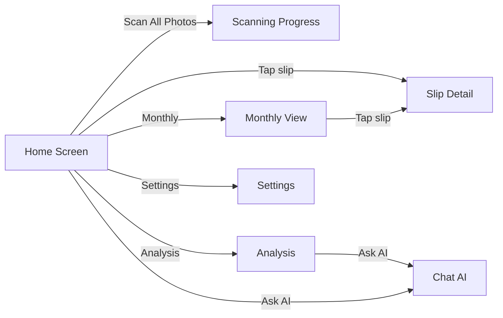
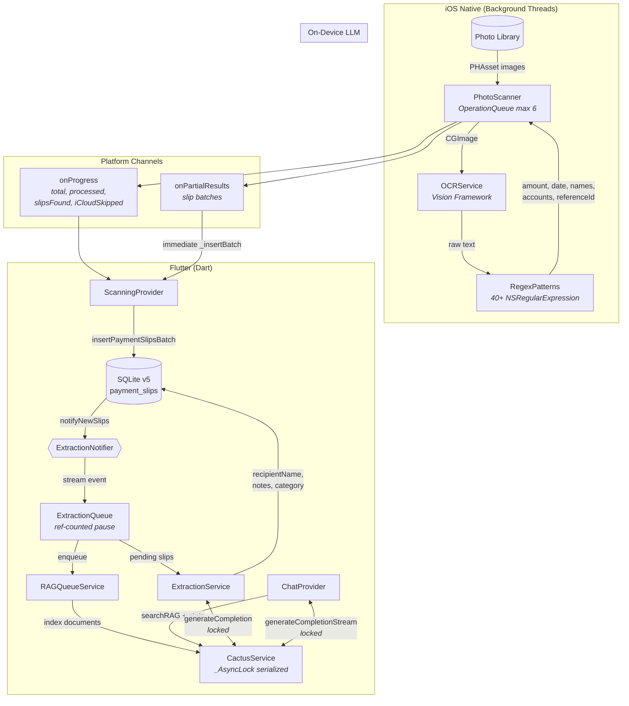
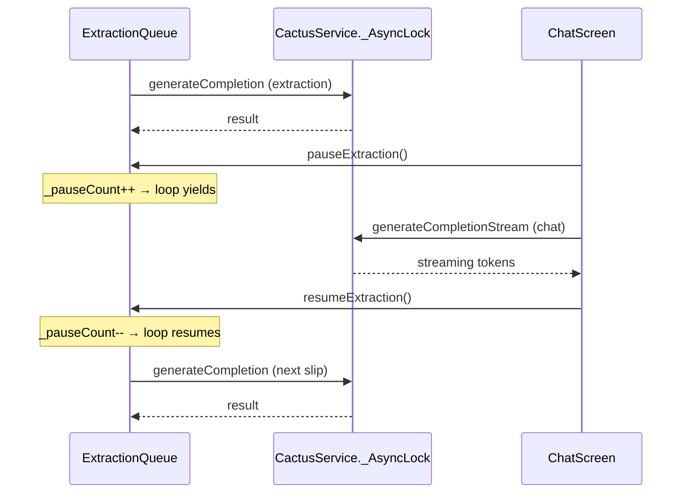

# Slip Scanner


iOS app that scans payment slips from your photo library using Apple Vision Framework OCR. Specializes in Thai banking slips (SCB, KBank Make/K Plus, Dime) with Thai language text recognition, Buddhist calendar conversion, and on-device LLM extraction via CactusLM.

## Requirements

- Flutter SDK 3.38+
- Xcode (latest)
- iOS 15.6+ device or simulator
- CocoaPods

## Getting Started

```bash
# Install dependencies
flutter pub get
cd ios && pod install && cd ..

# Generate code (Riverpod, Freezed, AutoRoute)
dart run build_runner build --delete-conflicting-outputs

# Run on iOS simulator or device
flutter run
```

## Development Commands

```bash
flutter run                  # Run on iOS simulator/device
flutter build ios            # Build for iOS release
flutter analyze              # Static analysis (includes riverpod_lint)
dart run build_runner watch  # Watch mode for code generation
```

## Testing

### Dart Tests

```bash
flutter test                                        # Run all Dart tests
flutter test test/scanning_conversion_test.dart      # Run a specific test file
flutter test --reporter expanded                     # Verbose output
```

### iOS XCTests (OCR & Regex Extraction)

Requires an iOS Simulator. Tests the native OCR extraction pipeline: amounts, dates, names, accounts, reference IDs, Buddhist calendar conversion, and `buildSlipResult` assembly across all bank formats (SCB, KBank Make/K Plus, Dime).

```bash
cd ios && xcodebuild test -workspace Runner.xcworkspace -scheme Runner \
  -destination 'platform=iOS Simulator,name=iPhone 17 Pro' \
  -only-testing:RunnerTests/OCRExtractionTests \
  -only-testing:RunnerTests/BuddhistCalendarTests \
  -only-testing:RunnerTests/BuildSlipResultTests
```

### Test Structure

- `test/scanning_conversion_test.dart` -- Dart unit tests for slip data conversion: `nonEmpty` helper, `parseThaiDate` (ISO, DD/MM/YYYY, English month formats), and `convertSlipsInIsolate` (platform data to `PaymentSlip` model, type coercion, optional field handling).
- `ios/RunnerTests/OCRExtractionTests.swift` -- Text-based extraction tests for all bank formats: amount, date, reference ID, name, account number, and time extraction.
- `ios/RunnerTests/BuddhistCalendarTests.swift` -- Buddhist year detection/conversion (4-digit BE, 2-digit BE) and `normalizeToISODate` format handling.
- `ios/RunnerTests/BuildSlipResultTests.swift` -- Full text-to-dictionary assembly tests, empty field handling, and truncation behavior.
- `ios/RunnerTests/OCRImageTests.swift` -- Template for image-based full-pipeline tests (add slip images to `Fixtures/Images/`).
- `ios/RunnerTests/Fixtures/` -- OCR text fixtures per bank (SCBFixtures, KBankMakeFixtures, KBankPlusFixtures, DimeFixtures) with expected extraction values.

### Adding a Regression Test

When a slip doesn't parse correctly:

1. Get the OCR text (from `extractedText` in the database or scanner log)
2. Add it as a new static constant in the appropriate bank fixture file in `ios/RunnerTests/Fixtures/`
3. Add expected values to the `Expected` struct
4. Write a one-line test assertion in the relevant test file
5. Fix the regex/extraction logic, then run all tests to verify no regressions

### What to Test Manually

Since the app relies on iOS platform channels and photo library access, some features require manual testing on a real device:

- **Photo scanning**: Grant photo library access, trigger a scan, verify slips are detected and saved
- **iCloud photos**: Ensure iCloud-only photos are skipped gracefully with a count shown
- **LLM extraction**: Verify CactusLM extracts recipient name, notes, and category from OCR text
- **Chat**: Open the chat screen, confirm extraction pauses, and LLM responds with expense context

## Architecture

### Screen Navigation



### Processing Pipeline



### LLM Lock Contention Avoidance



See [CLAUDE.md](CLAUDE.md) for detailed architecture documentation including database schema, key conventions, and iOS native implementation details.
